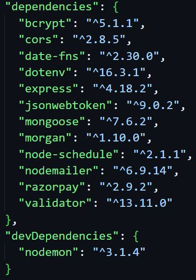

# Vinayak Canteen Website

Client-side Repository is present at [vinayak-night-canteen-client](https://github.com/mr-kingshuk/vinayak-night-canteen-client)


## Table of Contents
1. [Problems Faced in College](#problems-faced-in-college)
2. [Solution Provided by This Software](#solution-provided-by-this-software)
3. [Proof of Work](#proof-of-work)
4. [Running Loaclly](#running-locally)
5. [Dependencies](#dependencies)
6. [Environment Variables](#environment-variables)
7. [Workflow Diagrams](#workflow-diagrams)
8. [Database Modeling](#database-modeling)
9. [Middlewares](#middlewares)
10. [API Reference](#api-reference)
    - [Orders API](#orders-api)
    - [Items-Category API](#items-category-api)
    - [Password API](#password-api)
    - [Store Timing API](#store-timing-api)
    - [Users API](#users-api)
    - [Workers API](#workers-api)
11. [Contributing](#contributing)    
12. [License](#license)

## Problems Faced in College

So, last year in 2023, access to food at late night was limited due to the fact that after 10:45 PM (our hostel in-time), hot food was only available via phone orders to the Vinayak Store, which often led to a few problems:

1. **Inefficient Communication** between the Vinayak Store and customers led to **late deliveries**, missed orders due to **unreceived calls**, and **incorrect orders** due to confusion between orders, causing significant frustration among users.

2. Lack of motivation among late-night workers led to delays in food preparation, and declining Quality of Service (QoS), resulting in repeated student complaints and a cycle of dissatisfaction that further demotivated workers.

3. **Store Owner of Canteen** felt his store's reputation getting tarnished despite sufficient stock, and service inefficiencies led to complaints and tarnished the store's reputation within the college.

This was all due to **Lack of Central Monitoring**, which left students uninformed about order status and inventory levels, leading to confusion and misconceptions. The store owner’s lack of visibility into orders and stock sometimes resulted in workers lying about item availability to reduce their workload.

Addressing these issues is crucial for improving the operational environment for the **Vinayak Store** and Night Canteen as a whole.

## Solution Provided by This Software
To address these challenges, I developed a comprehensive Night Canteen Website for Vinayak Canteen. The platform features a 3-tier user role system, including **`User`**, **`Worker`**, and **`Merchant`** profiles. Key functionalities include:

- **Integrated Razorpay** for secure payments, ensuring a smooth transaction process.
- **WebSockets** using socket.io for real-time communication, enabling Workers to receive and manage orders instantly.
- **Cron jobs** to manage item availability based on store timings, automatically toggling items off when the store closes and on when it opens.
- **Manual control of items** through the Worker interface, allowing for dynamic menu management.
- **Central State Management** to efficiently handle the state of User Details and Order Details, enabling users to add items to the cart from both the Menu HomePage and the Order Summary Page.
- **Use of localStorage** to persist User and Order Details, allowing for easy access when the User returns to the website later.
- A robust **CMS portal** for Merchants to manage menu items and store timings, along with a **CRM portal** to track all orders, including canceled and delivered orders.

This project highlights advanced web development skills with a focus on real-time communication, payment integration, and efficient store management.

## Proof of Work 

This project has received formal approval from **Dr. Nabyendu Das**, Chief Warden of The LNM Institute of Information Technology, Jaipur, signifying its alignment with the institute's goals and objectives.


> *Screenshot of the email from the Chief Warden of my college, confirming the approval of the project.*

## Running Locally

To set up the project locally, follow these steps:

0. **Clone the repositories**:
   - For the server: 
     ```
     git clone https://github.com/mr-kingshuk/vinayak-night-canteen-server.git
     ```
   - For the client: 
     ```
     git clone https://github.com/mr-kingshuk/vinayak-night-canteen-client.git
     ```

1. **Fill the `.env` file**: 
   - Use the `template.env` file as a reference to configure your environment variables.

2. **Set up the database connection**:
   - Add the database connection string for both production and development environments.
   - Set `NODE_ENV` to `development`. (When pushing code to production, change `NODE_ENV` to `production`.)

3. **Install dependencies and run the server and client**:
   - Navigate to the server folder:
     ```bash
     cd vinayak-night-canteen-server
     npm install
     npm run dev
     ```
   - Then, navigate to the client folder:
     ```bash
     cd ../vinayak-night-canteen-client
     npm install
     npm start
     ```

4. **Create a new account**:
   - Sign up for a new account that you want to have Merchant access.

5. **Upgrade user to Merchant role**:
   - Add the following entry to the `userTypes` collection in the database:
     ```json
     {"userId":{"$oid":"MongoDb _id for merchant user"},"type":"merchant"}
     ```
   - Alternatively, call the POST endpoint to upgrade the user:
     ```
     POST http://localhost:3000/merchant
     ```
     - Include the Authorization token (JWT Token, returned as a response after logging in or signing up) in the request header.

6. **Add Categories, Items, and Store Timing**:
   - Configure categories and items, set store timings, and create worker profiles.

7. **Project Ready**:
   - Your project is now ready for use by user, worker, and merchant profiles.

## Dependencies



## Environment Variables

To run this project, you will need to add the following environment variables to your `.env` file:

- `PORT`: The port number on which the server will run.
  
- `MONGO_URI_PROD`: MongoDB connection string for the production environment.
  
- `MONGO_URI_DEV`: MongoDB connection string for the development environment.

- `SECRET`: JWT secret key used for signing and verifying tokens.

- `RAZORPAY_ID_KEY`: Razorpay API ID key for processing payments.

- `RAZORPAY_SECRET_KEY`: Razorpay API secret key for secure payment transactions.

- `NODE_ENV`: Defines the environment in which the application is running (`development` or `production`).

- `BASE_URL_SERVER`: The base URL of the server where the backend is hosted.

- `BASE_URL_CLIENT`: The base URL of the client where the frontend is hosted.

- `EMAIL`: The email address from which automated emails will be sent.

- `PASSWORD_APP_EMAIL`: The less secure app password for the email account used for sending emails.

- `TZ`: Time zone setting to change the server time from UTC to IST (Asia/Kolkata) for correct scheduling on Render.

## Workflow Diagrams

The following diagrams illustrate the communication between the client and server for two major workflows utilized in this project.

### Razorpay Payment Verification Workflow

> *This diagram depicts the two-step verification process between the client and server for Razorpay payment verification.*

### Reset Password Workflow

> *This diagram illustrates the two-step verification process between the client and server for the reset password functionality.*

## Database Modeling

The models define the structure of the data in the database. This project uses Mongoose to interact with a MongoDB database, via the MongoDB URI Connection String

# Middlewares

The middleware in this project is responsible for handling tasks such as authentication and authorization for different types of users. Each middleware function ensures that only authenticated and authorized users can access specific routes.

1. **AuthHandler.js**: 
  - This middleware verifies the user is authentication by checking the authorization token sent in the request headers.
  - The token is extracted from the `Authorization` header, typically following the `Bearer` schema.
  - The middleware then verifies the token using a secret key. If the token is valid, the user's ID is extracted and used to retrieve the user's record from the database.
  - If the user is authenticated, the request proceeds to the next middleware or route handler; otherwise, an error response is returned.

2. **isMerchant.js**:
  - This middleware extends the basic authentication check by verifying that the authenticated user is specifically a merchant.
  - After verifying the token, the middleware checks the user's type in the database.
  - If the user is identified as a merchant, the request proceeds; otherwise, an error is returned indicating that only merchant profiles are authorized to access the route.

3. **isWorker.js**:
  - Similar to the `isMerchant.js` middleware, this function verifies that the authenticated user is a worker.
  - The token is verified, and the middleware checks the user's type in the database to confirm they are a worker.
  - If the user is a worker, the request continues; otherwise, an error response is provided, stating that only worker profiles are authorized to access the route.


## API Reference
### Orders API
<details>
<summary> 1. Get All Delivered Orders</summary><br>
   
**Description:**  Retrieves a paginated list of delivered orders for a specific date. Orders are sorted by **`createdAt`** in descending order, with date filtering using **`startOfDay`** and **`endOfDay`** of the **`date-fns`** library. Pagination limits results per page.

```bash
  GET /api/orders/deliver
```
**Middleware:** `isMerchant`

| Parameter    |   Type    | Description                       | Required |
| :----------- | :-------- | :-------------------------------- | :------- |
| `date`       | `string`  | Date in YYYY-MM-DD format         | Yes      |
| `page`       | `integer` | Current page number               | No       |
| `per_page`   | `integer` | Number of orders per page         | No       |

**Response Summary:**

- **200:** Success, returns a list of delivered orders with pagination metadata.
- **400:** Invalid page number or no orders found.
- **500:** Server error.
</details>

<details>
<summary>1. Get All Delivered Orders</summary><br>

```bash
  GET /api/orders/deliver
```
**Middleware:** `isMerchant`

**Description:**  Retrieves a paginated list of delivered orders for a specific date. Orders are sorted by **`createdAt`** in descending order, with date filtering using **`startOfDay`** and **`endOfDay`** of the **`date-fns`** library. Pagination limits results per page.

| Parameter    |   Type    | Description                       | Required |
| :----------- | :-------- | :-------------------------------- | :------- |
| `date`       | `string`  | Date in YYYY-MM-DD format         | Yes      |
| `page`       | `integer` | Current page number               | No       |
| `per_page`   | `integer` | Number of orders per page         | No       |

**Response Summary:**

- **200:** Success, returns a list of delivered orders with pagination metadata.
- **400:** Invalid page number or no orders found.
- **500:** Server error.
</details>

## Contributing

Thank you for considering contributing to the Vinayak Canteen Website project! We welcome contributions from the community to improve and enhance the application. Here's how you can contribute:

### 1. Fork the Repository

- Click the "Fork" button in the top-right corner.
- **Star the repository** to show your support and check the **Issues tab** for any tasks you might be interested in.

### 2. Clone the Repository

- Clone your forked repository to your local machine:

    ```bash
    git clone https://github.com/mr-kingshuk/vinayak-night-canteen-server.git
    ```

- Run this code on your local machine. Check [Running Locally](#running-locally) for more details.    

### 3. Create a New Branch

- Create a new branch for your feature or bug fix:

    ```bash
    git checkout -b feature/your-feature-name
    ```

### 4. Make Your Changes

- Implement your feature or fix the bug following the project's coding guidelines.

### 5. Commit Your Changes

- Commit your changes with a clear and descriptive message:

    ```bash
    git commit -m "Add your detailed message here"
    ```

### 6. Push to Your Branch

- Push your changes to your branch:

    ```bash
    git push origin feature/your-feature-name
    ```

### 7. Open a Pull Request

- Go to the original repository and open a pull request. Provide a detailed description of the changes you’ve made.

### Reporting Issues and Suggestions

If you encounter any issues or have questions, feel free to open an issue in the repository. Please provide detailed information to help us address the issue effectively. We're also always open to suggestions for improvement. If you have an idea, open an issue to discuss it with the maintainers and the community.

## License

**Copyright (c) 2024 Kingshuk Ghosh** — Licensed under the MIT License. [MIT License Link](https://opensource.org/license/mit)
