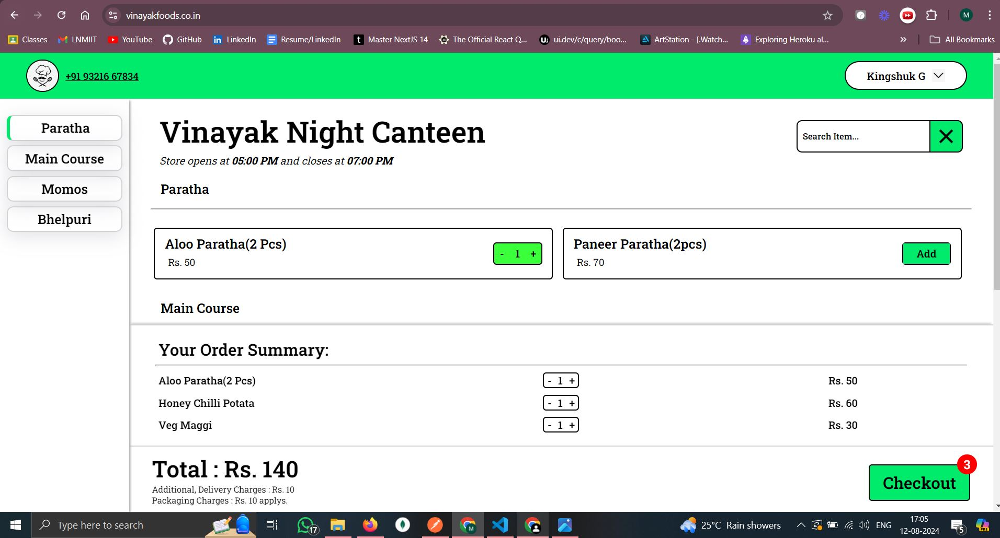
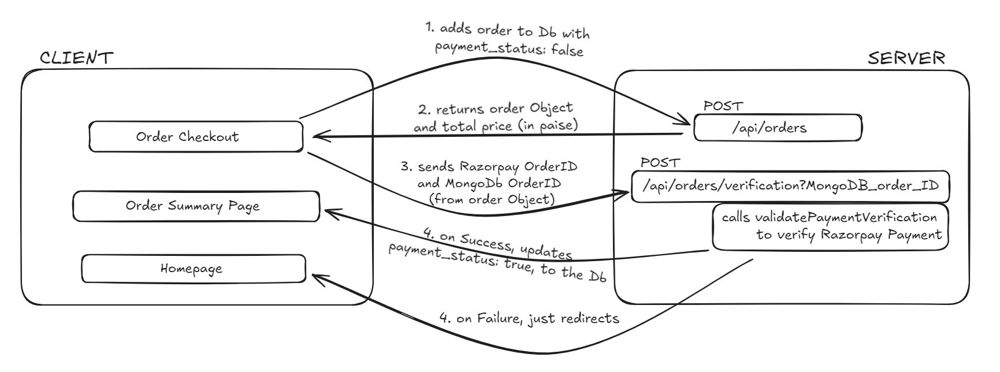
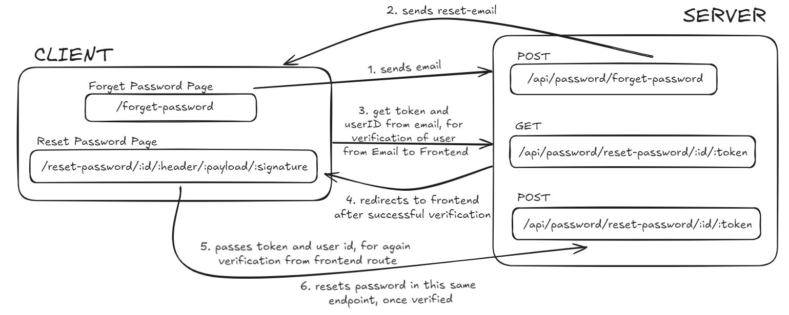

# Vinayak Canteen Website

Client-side Repository is present at [vinayak-night-canteen-client](https://github.com/mr-kingshuk/vinayak-night-canteen-client)



## Table of Contents
1. [Problems Faced in College](#problems-faced-in-college)
2. [Solution Provided by This Software](#solution-provided-by-this-software)
3. [Proof of Work](#proof-of-work)
4. [Running Loaclly](#running-locally)
5. [Dependencies](#dependencies)
6. [Environment Variables](#environment-variables)
7. [Workflow Diagrams](#workflow-diagrams)
8. [Database Modeling](#database-modeling)
9. [Middlewares](#middlewares)
10. [API Reference](#api-reference)
    - [Orders API](#orders-api)
    - [Items-Category API](#items-category-api)
    - [Password API](#password-api)
    - [Store Timing API](#store-timing-api)
    - [Users API](#users-api)
    - [Workers API](#workers-api)
11. [Contributing](#contributing)    
12. [License](#license)

## Problems Faced in College

So, last year in 2023, access to food at late night was limited due to the fact that after **10:45 PM (our hostel in-time)**, hot food was only available via phone orders to the Vinayak Store, which often led to a few problems:

1. <ins>**Inefficient Communication**</ins> between the Vinayak Store and customers led to <ins>**late deliveries**</ins>, missed orders due to <ins>**unreceived calls**</ins>, and <ins>**incorrect orders**</ins> due to confusion between orders, causing significant frustration among users.

2. Lack of motivation among late-night workers led to delays in food preparation, and declining Quality of Service (QoS), resulting in repeated student complaints and a cycle of dissatisfaction that further demotivated workers.

3.  The <ins>**Store Owner of Canteen**</ins> felt that the store's reputation was being tarnished due to service inefficiencies, despite having sufficient stock, which led to complaints within the college.

This was all due to <ins>**Lack of Central Monitoring**</ins>, which left students uninformed about order status and inventory levels, leading to confusion and misconceptions. The store owner’s lack of visibility into orders and stock sometimes resulted in workers lying about item availability to reduce their workload.

Addressing these issues is crucial for improving the operational environment for the **Vinayak Store** and Night Canteen as a whole.

## Solution Provided by This Software
To address these challenges, I developed a comprehensive Night Canteen Website for Vinayak Canteen. The platform features a 3-tier user role system, including **`User`**, **`Worker`**, and **`Merchant`** profiles. Key functionalities include:

- <ins>**Integrated Razorpay**</ins> for secure payments, ensuring a smooth transaction process.
- <ins>**Cron jobs**</ins> to manage item availability based on store timings, automatically toggling items off when the store closes and on when it opens.
- <ins>**Manual control of items**</ins> through the Worker interface, allowing for dynamic menu management.
- <ins>**Central State Management**</ins> to efficiently handle the state of User Details and Order Details, enabling users to add items to the cart from both the Menu HomePage and the Order Summary Page.
- <ins>**Use of localStorage**</ins> to persist User and Order Details, allowing for easy access when the User returns to the website later.
- A robust <ins>**CMS portal**</ins> for Merchants to manage menu items and store timings, along with a <ins>**CRM portal**</ins> to track all orders, including cancelled and delivered orders.

This project highlights advanced web development skills with a focus on real-time communication, payment integration, and efficient store management.

## Proof of Work 

This project has received formal approval from **Dr. Nabyendu Das**, Chief Warden of The LNM Institute of Information Technology, Jaipur, signifying its alignment with the institute's goals and objectives.


> *Screenshot of the email from the Chief Warden of my college, confirming the approval of the project.*

## Running Locally

To set up the project locally, follow these steps:

0. **Clone the repositories**:
   - For the server: 
     ```
     git clone https://github.com/mr-kingshuk/vinayak-night-canteen-server.git
     ```
   - For the client: 
     ```
     git clone https://github.com/mr-kingshuk/vinayak-night-canteen-client.git
     ```

1. **Fill the `.env` file**: 
   - Use the `template.env` file as a reference to configure your environment variables.

2. **Set up the database connection in server**:
   - Add the database connection string for both production and development environments.
   - Set `NODE_ENV` to `development`. (When pushing code to production, change `NODE_ENV` to `production`.)

3. **Install dependencies and run the server and client**:
   - Navigate to the server folder:
     ```bash
     cd vinayak-night-canteen-server
     npm install
     npm run dev
     ```
   - Then, navigate to the client folder:
     ```bash
     cd ../vinayak-night-canteen-client
     npm install
     npm start
     ```

4. **Create a new account**:
   - Sign up for a new account that you want to have Merchant access.

5. **Upgrade user to Merchant role**:
   - Add the following entry to the `userTypes` collection in the database:
     ```json
     {"userId":{"$oid":"MongoDb _id for merchant user"},"type":"merchant"}
     ```
   - Alternatively, call the POST endpoint to upgrade the user:
     ```
     POST http://localhost:3000/merchant
     ```
     - Include the Authorization token (JWT Token, returned as a response after logging in or signing up) in the request header.

6. **Add Categories, Items, and Store Timing**:
   - Configure categories and items, set store timings, and create worker profiles.

7. **Project Ready**:
   - Your project is now ready for use by user, worker, and merchant profiles.

## Dependencies

```json
  "dependencies": {
    "bcrypt": "^5.1.1",
    "cors": "^2.8.5",
    "date-fns": "^2.30.0",
    "dotenv": "^16.3.1",
    "express": "^4.18.2",
    "jsonwebtoken": "^9.0.2",
    "mongoose": "^7.6.2",
    "morgan": "^1.10.0",
    "node-schedule": "^2.1.1",
    "nodemailer": "^6.9.14",
    "razorpay": "^2.9.2",
    "validator": "^13.11.0"
  },
  "devDependencies": {
    "nodemon": "^3.1.4"
  }
```

## Environment Variables

To run this project, you will need to add the following environment variables to your `.env` file:

- `PORT`: The port number on which the server will run.
  
- `MONGO_URI_PROD`: MongoDB connection string for the production environment.
  
- `MONGO_URI_DEV`: MongoDB connection string for the development environment.

- `SECRET`: JWT secret key used for signing and verifying tokens.

- `RAZORPAY_ID_KEY`: Razorpay API ID key for processing payments.

- `RAZORPAY_SECRET_KEY`: Razorpay API secret key for secure payment transactions.

- `NODE_ENV`: Defines the environment in which the application is running (`development` or `production`).

- `BASE_URL_SERVER`: The base URL of the server where the backend is hosted.

- `BASE_URL_CLIENT`: The base URL of the client where the frontend is hosted.

- `EMAIL`: The email address from which automated emails will be sent.

- `PASSWORD_APP_EMAIL`: The less secure app password for the email account used for sending emails.

- `TZ`: Time zone setting to change the server time from UTC to IST (Asia/Kolkata) for correct scheduling on Render.

## Workflow Diagrams

The following diagrams illustrate the communication between the client and server for two major workflows utilized in this project.

### Razorpay Payment Verification Workflow

> *This diagram depicts the two-step verification process between the client and server for Razorpay payment verification.*

### Reset Password Workflow

> *This diagram illustrates the two-step verification process between the client and server for the reset password functionality.*

## Database Modeling

The models define the structure of the data in the database. This project uses Mongoose to interact with a MongoDB database, via the MongoDB URI Connection String

# Middlewares

The middleware in this project is responsible for handling tasks such as authentication and authorization for different types of users. Each middleware function ensures that only authenticated and authorized users can access specific routes.

1. <ins>**AuthHandler.js**</ins>: 
  - This middleware verifies the user is authentication by checking the authorization token sent in the request headers.
  - The token is extracted from the `Authorization` header, typically following the `Bearer` schema.
  - The middleware then verifies the token using a secret key. If the token is valid, the user's ID is extracted and used to retrieve the user's record from the database.
  - If the user is authenticated, the request proceeds to the next middleware or route handler; otherwise, an error response is returned.

2. <ins>**isMerchant.js**</ins>:
  - This middleware extends the basic authentication check by verifying that the authenticated user is specifically a merchant.
  - After verifying the token, the middleware checks the user's type in the database.
  - If the user is identified as a merchant, the request proceeds; otherwise, an error is returned indicating that only merchant profiles are authorized to access the route.

3. <ins>**isWorker.js**</ins>:
  - Similar to the `isMerchant.js` middleware, this function verifies that the authenticated user is a worker.
  - The token is verified, and the middleware checks the user's type in the database to confirm they are a worker.
  - If the user is a worker, the request continues; otherwise, an error response is provided, stating that only worker profiles are authorized to access the route.


## API Reference
### Orders API
<details open>
<summary><ins>1. Add New Order (Payment Not Confirmed)</ins></summary><br>
   
**Description:**  Adds a new order to the database, including order details and Razorpay payment initiation, and the `paymentStatus` is set to `false`, and `status` is set to `Accepted`. It verifies item availability, assigns an order number, calculates the total amount, and initiates a Razorpay payment order.

```bash
  POST /api/orders/
```
**Middleware:** `requireAuth`

| Parameter    |   Type    | Description                              | Required |
| :----------- | :-------- | :--------------------------------------- | :------- |
| `order`       | `array`   | List of items with name, price, quantity | Yes     |

**Response Summary:**

- **200:** Success, returns the order document reference and the total amount to be paid.
- **400:** One or many items have become unavailable.
- **500:** Server error.

</details>

<details>
<summary><ins>2. Verify Razorpay Payment</ins></summary><br>
   
**Description:** Verifies the payment using Razorpay's verification process. If the payment is successfully verified, the `paymentStatus` is set to `true` and the order details are updated with the Razorpay payment ID. If verification fails, the order number is decremented, and the user is redirected to the client base URL.

```bash
  POST /api/orders/verification
```

**Middleware:** None

| Parameter             |   Type    | Description                              | Required |
| :-------------------- | :-------- | :--------------------------------------- | :------- |
| `razorpay_payment_id` | `string`  | Razorpay Payment ID                      | Yes      |
| `razorpay_order_id`   | `string`  | Razorpay Order ID                        | Yes      |
| `razorpay_signature ` | `string`  | Razorpay Signature for verifying the payment                  | Yes      |
| `order`               | `array`   | Order ID used to find and update the corresponding order       | Yes      |

**Response Summary:**

- **302:** Redirects to the client with the order ID after successful payment verification.
- **400:** Redirects to the client base URL if the payment verification fails.

</details>

<details>
<summary><ins>3. Cancel Order</ins></summary><br>
   
**Description:** Marks an order as cancelled by updating its status to `Cancelled`. The order is identified by its ID, and only workers can perform this action.

```bash
  PATCH /api/orders/cancel/:id
```
**Middleware:** `isWorker`

| Parameter    |   Type    | Description                              | Required |
| :----------- | :-------- | :--------------------------------------- | :------- |
| `id`       | `string`   | ID of the order to be cancelled | Yes     |

**Response Summary:**

- **200:** Success, returns the updated order with the status set to `Cancelled`.
- **404:** No order found with the provided ID.
- **500:** Server error.

</details>

<details>
<summary><ins>4. Mark Order as Delivered</ins></summary><br>
   
**Description:** Marks an order as delivered by updating its status to `Delivered`. The order is identified by its ID, and only workers can perform this action.

```bash
  PATCH /api/orders/deliver/:id
```
**Middleware:** `isWorker`

| Parameter    |   Type    | Description                              | Required |
| :----------- | :-------- | :--------------------------------------- | :------- |
| `id`       | `string`   | ID of the order to be cancelled | Yes     |

**Response Summary:**

- **200:** Success, returns the updated order with the status set to `Delivered`.
- **404:** No order found with the provided ID.
- **500:** Server error.

</details>

<details>
<summary><ins>5. Get All Received Orders (Worker Side)</ins></summary><br>
   
**Description:** Retrieves all orders that have been accepted and successfully paid for. The orders are sorted in descending order based on their creation date.

```bash
  GET /api/orders/receivedOrder
```

**Middleware:** `isWorker`

**Response Summary:**

- **200:** Success, returns a list of all received orders with associated user details.
- **500:** Server error.

</details>

<details>
<summary><ins>6. Get Individual Order Details</ins></summary><br>
   
**Description:** Retrieves the details of an individual order identified by its ID. If the order exists and the payment status is true, it returns the order details along with the associated items. 

```bash
  GET /api/orders/order/:id
```
**Middleware:** `requireAuth`

| Parameter |   Type    | Description                          | Required |
| :-------- | :-------- | :----------------------------------- | :------- |
| `id`      | `string`  | ID of the order to retrieve         | Yes      |

**Response Summary:**

- **200:** Success, returns the order details and associated items.
- **400:** Not Valid OrderId if the provided ID is not a valid MongoDB ObjectId.
- **404:** Order not found if the order does not exist or payment status is false.
- **500:** Server error.
</details>

<details>
<summary><ins>7. Get All Orders of a Particular User</ins></summary><br>
   
**Description:** Retrieves all orders for the authenticated user, including pagination support. It returns only paid orders i.e. orders with `paymentStatus` set to `true`, with metadata about the total number of items and pages.

```bash
  GET /api/orders/orders
```
**Middleware:** `requireAuth`

| Parameter  |   Type    | Description                          | Required |
| :--------- | :-------- | :----------------------------------- | :------- |
| `page`     | `integer` | Current page number                  | No      |
| `per_page` | `integer` | Number of orders per page            | No      |

**Response Summary:**

- **200:** Success, returns a list of orders with pagination metadata.
- **400:** Invalid Page Number if the requested page exceeds total pages, or "No orders found" if the user has no orders.
- **500:** Server error.

</details>

<details>
<summary><ins>8. Get All Delivered Orders</ins></summary><br>

**Description:**  Retrieves a paginated list of delivered orders for a specific date. Orders are sorted by **`createdAt`** in descending order, with date filtering using **`startOfDay`** and **`endOfDay`** of the **`date-fns`** library. Pagination limits results per page.

```bash
  GET /api/orders/deliver
```
**Middleware:** `isMerchant`

| Parameter    |   Type    | Description                       | Required |
| :----------- | :-------- | :-------------------------------- | :------- |
| `date`       | `string`  | Date in YYYY-MM-DD format         | Yes      |
| `page`       | `integer` | Current page number               | No       |
| `per_page`   | `integer` | Number of orders per page         | No       |

**Response Summary:**

- **200:** Success, returns a list of delivered orders with pagination metadata.
- **400:** Invalid page number or no orders found.
- **500:** Server error.
</details>

<details>
<summary><ins>9. Get All Deleted Orders</ins></summary><br>
   
**Description:** Retrieves all orders that have been cancelled, including pagination support. It returns deleted orders along with metadata about the total number of items and pages.

```bash
  GET /api/orders/cancel
```
**Middleware:** `isMerchant`

| Parameter  |   Type    | Description                          | Required |
| :--------- | :-------- | :----------------------------------- | :------- |
| `page`     | `integer` | Current page number                  | No      |
| `per_page` | `integer` | Number of orders per page            | No      |

**Response Summary:**

- **200:** Success, returns a list of cancelled orders with pagination metadata.
- **400:** Invalid Page Number if the requested page exceeds total pages, or "No orders found" if there are no cancelled orders.
- **500:** Server error.

</details>

### Items-Category API
<details>
<summary><ins>1. Get Items and Categories</ins></summary><br>

**Description:** Retrieves all food items and their associated categories from the database. Accessible only to logged-in users.

```bash
  GET /api/fooditems/
```
**Middleware:** `requireAuth`

**Response Summary:**

- **200:** Success, returns a list of categories and items.
- **500:** Server error.
</details>

<details>
<summary><ins>2. Add Category</ins></summary><br>

**Description:** Adds a new category to the database with the name provided in the request body. The category name is converted to title case before being saved.

```bash
  POST /api/fooditems/category
```
**Middleware:** `isMerchant`

| Parameter | Type   | Description                     | Required |
| :-------- | :----- | :------------------------------ | :------- |
| `name`    | `string` | Name of the category to add     | Yes      |

**Response Summary:**

- **200:** Success, returns the newly created category.
- **400:** Please provide a Category Name if no name is provided in the request body.
- **500:** Server Error if there is an issue with the server.
</details>

<details>
<summary><ins>3. Delete Category</ins></summary><br>

**Description:** Deletes a category from the database along with its associated items.

```bash
  DELETE /api/fooditems/category/:id
```

**Middleware:** `isMerchant`

| Parameter | Type   | Description               | Required |
| :-------- | :----- | :------------------------ | :------- |
| `id`      | `string` | ID of the category to delete | Yes      |

**Response Summary:**

- **200:** Success, returns the deleted category and associated items.
- **404:** Category doesn't exist if the specified category ID does not match any category.
- **500:** Server Error if there is an issue with the server.

</details>
<details>
<summary><ins>4. Add Item</ins></summary><br>

**Description:** Adds a new item to the database under the specified category.

```bash
  POST /api/fooditems/item/:categoryId
```

**Middleware:** `isMerchant`

| Parameter   | Type     | Description                        | Required |
| :---------- | :------- | :--------------------------------- | :------- |
| `categoryId` | `string` | ID of the category to add the item to | Yes      |
| `name`      | `string` | Name of the item to add           | Yes      |
| `price`     | `number` | Price of the item                  | Yes      |

**Response Summary:**

- **200:** Success, returns the newly created item.
- **400:** Please fill all fields if any required field is missing.
- **404:** Category doesn't exist if the specified category ID does not match any category.
- **500:** Server Error if there is an issue with the server.

</details>

<details>
<summary><ins>5. Delete Item</ins></summary><br>

**Description:** Deletes an item from the database by its ID.

```bash
  DELETE /api/fooditems/item/:id
```
**Middleware:** `isMerchant`

| Parameter | Type     | Description                          | Required |
| :-------- | :------- | :----------------------------------- | :------- |
| `id`      | `string` | ID of the item to be deleted        | Yes      |

**Response Summary:**

- **200:** Success, returns the deleted item.
- **404:** Item doesn't exist if the specified ID does not match any item.
- **500:** Server Error if there is an issue with the server.
</details>

<details>
<summary><ins>6. Item Turn Off/On</ins></summary><br>

**Description:** Toggles the availability status of an existing item.

```bash
  PATCH /api/fooditems/itemsChange/:id
```
**Middleware:** `isWorker`

| Parameter | Type     | Description                               | Required |
| :-------- | :------- | :---------------------------------------- | :------- |
| `id`      | `string` | ID of the item to change availability     | Yes      |

**Response Summary:**

- **200:** Success, returns the updated availability status of the item.
- **404:** Item not found if the specified ID does not match any item.
- **500:** Server Error if there is an issue with the server.

</details>

### Password API
<details>
<summary><ins>1. Send Reset Password Link</ins></summary><br>

**Description:** Sends a reset password link to the specified email if it exists in the database.

```bash
POST /api/password/forget-password
```
**Parameters:** 

| Parameter | Type   | Description                        | Required |
| :-------- | :----- | :--------------------------------- | :------- |
| `email`   | `string` | Email of the user for password reset | Yes      |

**Response Summary:**

- **200:** Reset Mail sent.
- **404:** Email is not found if the specified email does not exist in the database.
- **500:** Server Error if there is an issue with the server.
</details>

<details>
<summary><ins>2. Verify Reset Password Link</ins></summary><br>

**Description:** Verifies the reset password link and redirects the user to the reset password form.

```bash
GET /api/password/reset-password/:id/:token
```

**Parameters:**

| Parameter | Type   | Description                                     | Required |
| :-------- | :----- | :---------------------------------------------- | :------- |
| `id`      | `string` | ID of the user requesting password reset        | Yes      |
| `token`   | `string` | JWT token for verification                       | Yes      |

**Response Summary:**

- **200:** Redirects to the client reset password page.
- **404:** User is not found if the specified user ID does not exist, or Invalid Link if the token verification fails.
- **500:** Server Error if there is an issue with the server.
</details>

<details>
<summary><ins>3. Reset Password</ins></summary><br>

**Description:** Resets the user's password if the provided token is valid and matches the user's email.

```bash
POST /api/password/reset-password/:id/:token
```
**Parameters:**

| Parameter      | Type   | Description                                       | Required |
| :------------- | :----- | :------------------------------------------------ | :------- |
| `id`           | `string` | ID of the user                                   | Yes      |
| `token`        | `string` | JWT token for verification                        | Yes      |
| `password`     | `string` | New password for the user                        | Yes      |
| `passwordAgain`| `string` | Confirmation of the new password                | Yes      |

**Response Summary:**

- **200:** Returns the updated user object after password reset.
- **400:** Reset Email Link has expired if the ID is not valid, or All fields must be filled if required fields are missing.
- **404:** User is not found if the specified user ID does not exist, or Passwords don't match if the new password and confirmation do not match, or Password must meet complexity requirements if the new password is not strong enough.
- **500:** Server Error if there is an issue with the server.

<details>

### Store Timing API
<details>
<summary><ins>1. Add Store Timing</ins></summary><br>
**Description:** Adds store timing and changes the scheduled time to manage item availability, reset order numbers, and update item statuses based on current time.

```bash
POST /api/timing
```
**Middleware:** `isMerchant`

**Parameters:**

| Parameter   | Type   | Description                                          | Required |
|-------------|--------|------------------------------------------------------|----------|
| openHour    | number | Opening hour of the store in 24-hour format         | Yes      |
| openMin     | number | Opening minute of the store                          | Yes      |
| closeHour   | number | Closing hour of the store in 24-hour format         | Yes      |
| closeMin    | number | Closing minute of the store                          | Yes      |

**Response Summary:**

- **200:** Returns the updated store timing details.
- **400:** Error if any timing fields are missing.
- **404:** Timing out of bounds if the provided hours or minutes are invalid.
- **500:** Internal Server Error if there is an issue with the server.

</details>

<details>
<summary><ins>2. Get Store Timing</ins></summary><br>
**Description:** Retrieves the store timing for the user.

```bash
GET /api/timing/time
```
**Response Summary:**

- **200:** Returns the store timing details.
- **500:** Server Error if there is an issue with the server.
</details>

### Users API

<details>
<summary><ins>1. User Login</ins></summary><br>
**Description:** Authenticates a user by email and password, returning a JWT token and user details upon successful login.

```bash
POST /api/users/login
```
**Parameters:**

| Parameter | Type   | Description                  | Required |
|-----------|--------|------------------------------|----------|
| email     | string | Email of the user            | Yes      |
| password  | string | Password of the user         | Yes      |

**Response Summary:**

- **200:** Returns user object with email and token, along with user details (name, rollNo, phoneNo, hostel).
- **400:** Error if any fields are missing, if the email doesn't exist, or if the password doesn't match.
- **500:** Server Error if there is an issue with the server.
</details>

<details>
<summary><ins>2. Signup User</ins></summary><br>
**Description:** Creates a new user account  in the Database and returns a JWT token for authentication.

```bash
POST /api/users/signup
```
**Parameters:**

| Parameter         | Type    | Description                          | Required |
|-------------------|---------|--------------------------------------|----------|
| email             | string  | Email of the user                    | Yes      |
| password          | string  | Password of the user                 | Yes      |
| reEnterPassword   | string  | Confirmation of the password         | Yes      |
| name              | string  | Name of the user                     | Yes      |

**Response Summary:**

- **200:** Returns user object with email and token, along with user details (name).
- **400:** Error if any fields are missing or if the signup validation fails.
- **500:** Internal Server Error if there is an issue with the server.
</details>

<details>
<summary><ins>3. Update User Profile</ins></summary><br>
**Description:** Updates the user profile information, including name, phone number, roll number, and hostel, for logged in users only.

```bash
PATCH /api/users/profile
```
**Middleware:** `AuthHandler` (ensures the user is authenticated)

**Parameters:**

| Parameter | Type   | Description                         | Required |
|-----------|--------|-------------------------------------|----------|
| name      | string | Name of the user                    | Yes      |
| phoneNo   | string | Phone number of the user (10 digits)| Yes      |
| rollNo    | string | Roll number of the user             | Yes      |
| hostel    | string | Hostel of the user                  | Yes      |

**Response Summary:**

- **200:** Returns the updated user profile details (name, rollNo, phoneNo, hostel).
- **401:** Error if any fields are missing or if the phone number is invalid.
- **400:** Bad Request if there is an issue with the update.

</details>

### Workers API

<details>
<summary><ins>1. Get Workers</ins></summary><br>
**Description:** Retrieves all the worker details.

```bash
GET /api/workers
```
**Middleware:** `isMerchant` 

**Response Summary:**

- **200:** Returns an array of worker objects.
- **400:** Error if no users are found.
- **500:** Internal Server Error if there is an issue with the server.

</details>

<details>
<summary><ins>2. Delete Worker</ins></summary><br>
**Description:** Deletes the worker details based on the provided worker ID.

```bash
DELETE /api/workers/:id
```
**Middleware:** `isMerchant` (ensures the user is a merchant)

**Parameters:**

| Parameter | Type   | Description                     | Required |
|-----------|--------|---------------------------------|----------|
| id        | string | ID of the worker to be deleted  | Yes      |

**Response Summary:**

- **200:** Returns the ID of the deleted worker.
- **400:** Error if the document is not found.
- **500:** Internal Server Error if there is an issue with the server.
</details>

<details>
<summary><ins>3. Add Worker</ins></summary><br>
**Description:** Adds a new worker to userType if the email has already signed in, and made an account on the website.

```bash
POST /api/workers
```
**Middleware:** `isMerchant`

**Parameters:**

| Parameter | Type   | Description                             | Required |
|-----------|--------|-----------------------------------------|----------|
| email     | string | Email address of the user to be added   | Yes      |

**Response Summary:**

- **200:** Returns the newly created userType object for the worker.
- **404:** Error if the email is not provided, if the user is already a worker, or if the user is not found.
- **400:** Bad Request if there is an issue with the request.
</details>

11. [Contributing](#contributing) 

## Contributing 

Thank you for considering contributing to the Vinayak Canteen Website project! We welcome contributions from the community to improve and enhance the application. Here's how you can contribute:

### 1. Fork the Repository

- Click the "Fork" button in the top-right corner.
- **Star the repository** to show your support and check the **Issues tab** for any tasks you might be interested in.

### 2. Clone the Repository

- Clone your forked repository to your local machine:

    ```bash
    git clone https://github.com/mr-kingshuk/vinayak-night-canteen-server.git
    ```

- Run this code on your local machine. Check [Running Locally](#running-locally) for more details.    

### 3. Create a New Branch

- Create a new branch for your feature or bug fix:

    ```bash
    git checkout -b feature/your-feature-name
    ```

### 4. Make Your Changes

- Implement your feature or fix the bug following the project's coding guidelines.

### 5. Commit Your Changes

- Commit your changes with a clear and descriptive message:

    ```bash
    git commit -m "Add your detailed message here"
    ```

### 6. Push to Your Branch

- Push your changes to your branch:

    ```bash
    git push origin feature/your-feature-name
    ```

### 7. Open a Pull Request

- Go to the original repository and open a pull request. Provide a detailed description of the changes you’ve made.

### Reporting Issues and Suggestions

If you encounter any issues or have questions, feel free to open an issue in the repository. Please provide detailed information to help us address the issue effectively. We're also always open to suggestions for improvement. If you have an idea, open an issue to discuss it with the maintainers and the community.

## License

**Copyright (c) 2024 Kingshuk Ghosh** — Licensed under the MIT License. [MIT License Link](https://opensource.org/license/mit)
